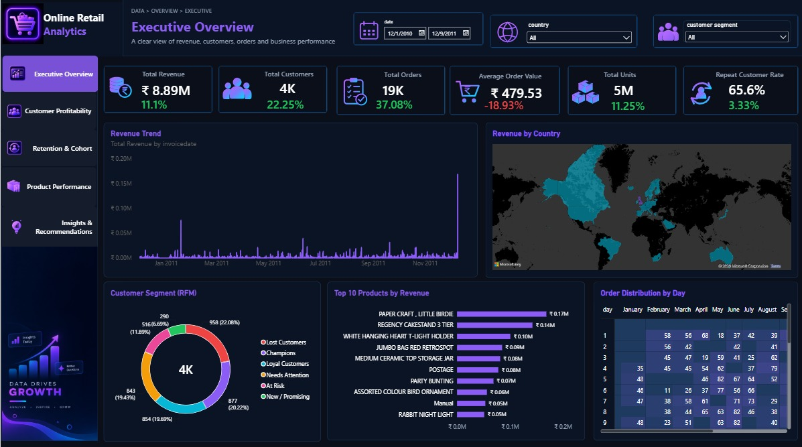
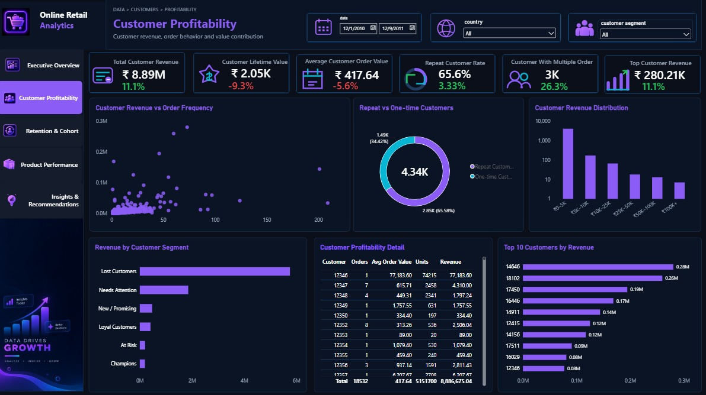
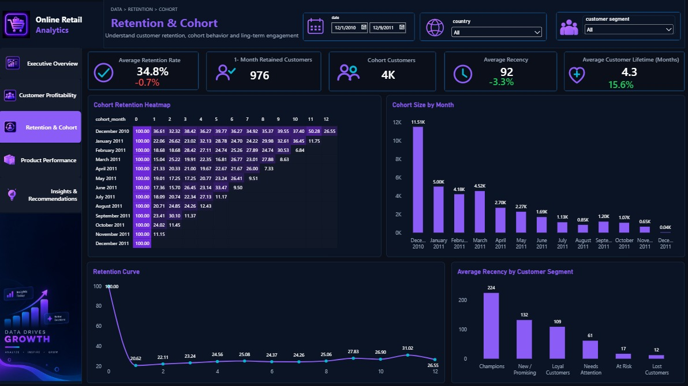
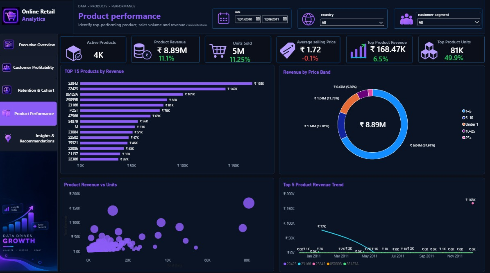
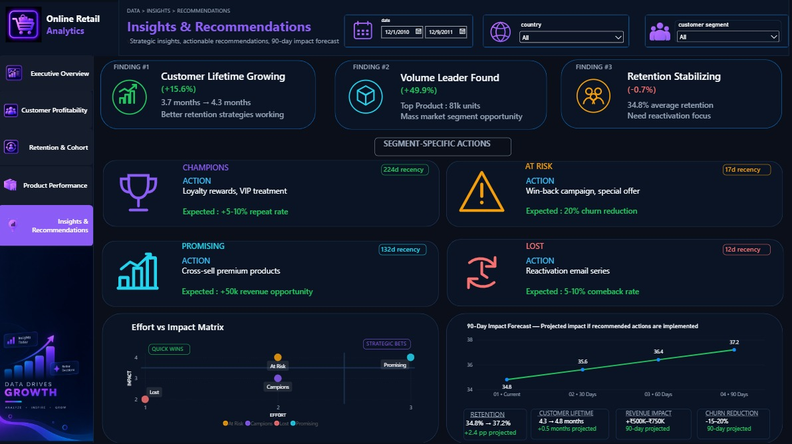

# Online Retail Customer Profitability, Retention & RFM Analysis

> A business-focused analytics project built to understand customer behavior, profitability, retention, product performance, and growth opportunities from online retail transaction data.

**Built with PostgreSQL, SQL, Power BI & DAX**

**Author:** Bidish Ranjan Mund

---

## 📌 Project Overview

Retail businesses generate a large amount of transaction data, but raw transactions alone do not explain **which customers are valuable, which customers are at risk, which products drive revenue, or where the next growth opportunity may come from.**

This project was built to turn transactional retail data into a practical business intelligence solution.

The goal was to create a complete analytics workflow — from data preparation and SQL analysis in PostgreSQL to a structured Power BI data model and an executive-style interactive dashboard.

The analysis focuses on four major business questions:

- Who are the most valuable customers?
- How well are customers being retained over time?
- Which products and pricing bands contribute most to revenue and sales volume?
- What actions can the business take based on the findings?

---

## 🎯 Business Objective

The project combines customer, product, revenue, retention, and purchasing behavior analysis into one integrated dashboard.

The key objectives were to:

- Understand overall business performance
- Measure customer profitability
- Segment customers using RFM analysis
- Analyze customer retention through cohorts
- Identify high-performing products
- Understand revenue and unit concentration
- Track month-over-month performance
- Translate analytical findings into actionable recommendations

---

## 🛠️ Tools & Technologies

| Tool | Purpose |
|---|---|
| **PostgreSQL** | Data cleaning, transformation and analytical SQL |
| **DBeaver** | SQL development and database management |
| **Power BI Desktop** | Data modeling, DAX and dashboard development |
| **DAX** | Business metrics and analytical measures |
| **GitHub** | Project documentation and portfolio presentation |

---

## 🗂️ Data Model

The Power BI model follows a **Star Schema** structure designed to keep the analytical model organized and scalable.

### Core Tables

- `fact_sales` — cleaned transaction-level sales data
- `dim_customer` — customer-level attributes
- `dim_product` — product-level information
- `dim_date` — date dimension
- `rfm_customer_segment` — customer RFM segmentation
- `cohort_retention_rate` — cohort retention analysis
- `customer_profitability` — customer profitability analysis

### Model Scale

The prepared analytical dataset contains approximately:

- **392K+ sales transactions**
- **4.3K+ customers**
- **3.6K+ products**
- **300+ dates**
- Customer-level RFM segmentation
- Cohort retention analysis
- Customer profitability analysis

---

## 📊 Analytical Framework

### 1. RFM Segmentation

Customers were evaluated using:

- **Recency** — how recently a customer purchased
- **Frequency** — how often a customer purchased
- **Monetary Value** — how much a customer contributed

The analysis groups customers into meaningful business segments such as:

- Champions
- Loyal Customers
- At Risk
- Needs Attention
- New / Promising
- Lost Customers

This makes it easier to move from customer-level data to targeted retention and growth strategies.

---

### 2. Customer Profitability

Customer-level analysis was used to understand:

- Revenue contribution
- Customer purchasing behavior
- High-value customers
- Customer concentration
- Profitability opportunities

The objective is not only to identify who generates revenue, but also to understand where customer value is concentrated.

---

### 3. Cohort Retention Analysis

Customers were grouped into cohorts based on their purchasing period and analyzed over time.

This helps answer:

- How well do customers return after their initial purchase?
- Which cohorts retain customers better?
- Where does retention decline?
- Where should reactivation efforts be focused?

---

### 4. Product Performance

Product-level analysis was developed to identify:

- Top products by revenue
- Top products by units sold
- Revenue concentration
- Revenue by price band
- Product revenue vs. sales volume
- Top-product revenue trends over time

This provides a clearer view of the relationship between **product demand, revenue contribution and sales volume.**

---

## 📈 Power BI Dashboard

The final Power BI report contains **5 interactive pages**, designed as an executive-style analytics dashboard.

### 01 — Executive Overview

Provides a high-level view of:

- Total Revenue
- Total Customers
- Total Orders
- Average Order Value
- Total Units
- Repeat Customer Rate
- Revenue trends
- Revenue by country
- Customer segment distribution
- Top products
- Order distribution

---

### 02 — Customer Profitability

Focuses on customer-level business value and purchasing behavior.

The page helps identify customer contribution, profitability patterns and important customer groups that require different business strategies.

---

### 03 — Retention & Cohort

Focuses on customer retention and cohort behavior.

Key areas include:

- Cohort retention
- Customer lifetime
- Retention trends
- RFM customer segments
- Segment-level customer behavior

---

### 04 — Product Performance

Focuses on product-level performance and revenue concentration.

Key analysis includes:

- Active Products
- Product Revenue
- Units Sold
- Average Selling Price
- Top Product Revenue
- Top Product Units
- Top products by revenue
- Revenue by price band
- Product revenue vs. units
- Top product revenue trends

---

### 05 — Insights & Recommendations

Converts the analytical findings into business-oriented recommendations.

The page includes:

- Top 3 business findings
- Segment-specific actions
- Effort vs. Impact prioritization
- 90-day impact forecast

The recommendations cover areas such as:

- Loyalty initiatives for Champions
- Win-back strategies for At Risk customers
- Cross-selling opportunities for Promising customers
- Reactivation strategies for Lost customers

The 90-day figures shown on this page are **projected scenarios**, not historical results.

---

## 🧮 DAX & Metrics

The dashboard contains **40+ DAX measures** covering areas such as:

- Revenue
- Customers
- Orders
- Units
- Average Order Value
- Customer retention
- Customer lifetime
- Product performance
- Month-over-month growth
- RFM analysis
- Profitability
- Product trends
- Forecast metrics

The measures were organized and formatted to support consistent reporting across the five dashboard pages.

---

## 💡 Key Business Insights

The dashboard was designed not just to display numbers, but to answer business questions.

Some of the key findings explored include:

### Customer Lifetime

Average customer lifetime increased from approximately **3.7 months to 4.3 months**, indicating a positive change in customer longevity within the analyzed period.

### Product Volume

The leading product showed approximately **49.9% growth in units**, highlighting an opportunity around high-volume product demand.

### Retention

Average retention was approximately **34.8%**, with the analysis indicating a need for continued reactivation and retention efforts.

These findings were then translated into segment-specific actions rather than treated as standalone metrics.

---

## 🎯 Business Recommendations

The project connects analytical findings with practical actions.

| Customer Segment | Recommended Action |
|---|---|
| **Champions** | Loyalty rewards and VIP treatment |
| **At Risk** | Win-back campaigns and targeted offers |
| **Promising** | Cross-sell premium products |
| **Lost** | Reactivation email campaigns |

The recommendations are intended as business strategies derived from the analysis, while the projected impact figures are scenario-based estimates.

---

## 🎨 Dashboard Design

The report was designed with an executive-style dark theme to keep the dashboard visually consistent and presentation-ready.

Design principles included:

- Dark navy background
- Consistent purple/cyan accent palette
- Structured KPI cards
- Clear visual hierarchy
- Consistent borders and spacing
- Minimal visual clutter
- Executive-style navigation
- Consistent formatting across all five pages

The objective was to make the dashboard both **analytically useful and portfolio-ready.**

---

## 📷 Dashboard Preview

### Executive Overview

### Customer Profitability

### Retention & Cohort

### Product Performance

### Insights & Recommendations

---

## 🚀 Project Outcome

This project demonstrates an end-to-end analytics workflow:

**Raw Transaction Data**

↓

**SQL Data Preparation**

↓

**PostgreSQL Analytical Tables**

↓

**Star Schema**

↓

**DAX Measures**

↓

**Power BI Dashboard**

↓

**Business Insights & Recommendations**

The final result is a five-page analytical dashboard that brings together customer behavior, profitability, retention, product performance and business recommendations in one reporting solution.

---

## 📚 Skills Demonstrated

- SQL
- PostgreSQL
- Data Cleaning
- Data Transformation
- Data Modeling
- Star Schema
- DAX
- Power BI
- RFM Analysis
- Cohort Analysis
- Customer Segmentation
- Customer Profitability Analysis
- Product Performance Analysis
- Business Intelligence
- Data Visualization
- Business Storytelling

---

## 👤 About the Author

**Bidish Ranjan Mund**

MBA student focused on developing practical skills in:

**Data Analytics • Business Intelligence • SQL • Power BI**

This project was created as a portfolio project to demonstrate how transactional data can be transformed into meaningful business insights and actionable recommendations.

---

## ⭐ Project

If you found this project useful or interesting, feel free to explore the dashboard screenshots and analysis in this repository.
